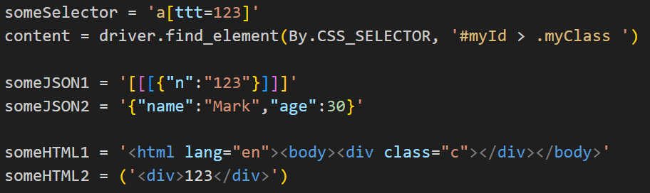
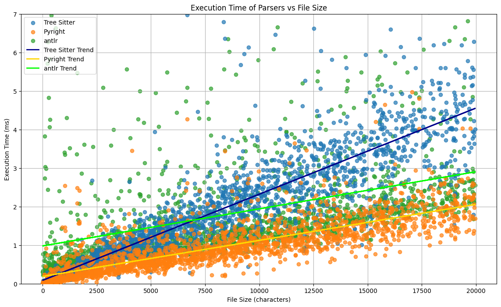

# Project Overview

This project offers a collection of features designed to enhance coding efficiency and streamline development processes. Below are the main components and functionalities included:

## Installation

To set up the project, simply run the following commands:

```
npm i
npm run package
```

After executing these commands, the VSIX file generated by npm run package needs to be installed in Visual Studio Code. To do this, open VS Code, then select the "Extensions" section (or press Ctrl+Shift+X), click on the three dots in the upper-right corner, and choose "Install from VSIX...". Then, select the generated VSIX file and install it.

## Features Implemented

### Typing Assist (Completer)

The Typing Assist feature serves as a code completer, aiding developers in writing code more efficiently.

#### Micro Example:

```python
print("some <caret>text")
-------------------
print("some "
      "<caret>text")
```

For detailed usage instructions, refer to the README located in `src/typing_assist`.

### Smart Delete

Smart Delete provides intelligent deletion capabilities, making it easier to remove code segments.

#### Micro Example:

```python
s = "123" + "big string which hard to delete"<caret>
-------------------
s = "123"<caret>
```

For detailed usage instructions, refer to the README located in `src/smart_delete`.

### Syntax Highlighting

The project includes syntax highlighting functionality to improve code readability.



For more information, refer to the README located in the `syntax` directory.

### Parser Benchmark

A benchmarking tool is provided to compare the performance of different parsers.



For detailed benchmark results and usage instructions, refer to the README located in `src/parser_benchmark`.

# ps1

Additionally, a feature was implemented to move the cursor down when commenting, similar to PyCharm.

# ps2

There is also functionality for testing Typing Assist and Smart Delete, with more details available in their respective README files.
