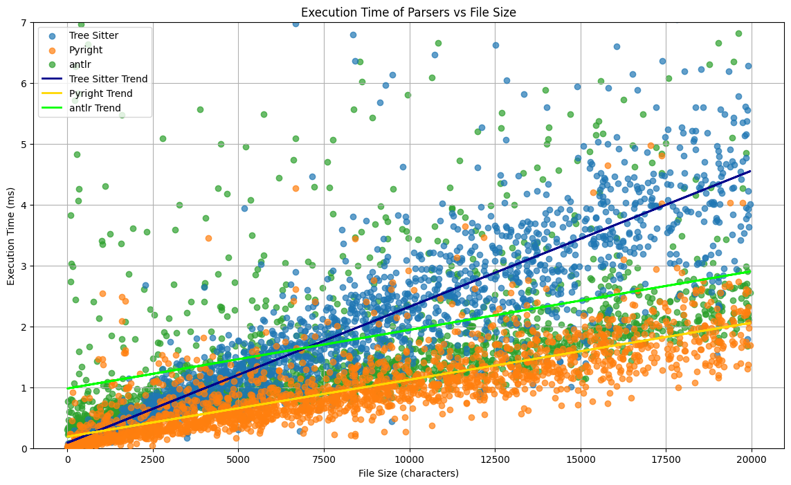

# Benchmarking Python Parsers

This repository provides a framework for benchmarking various Python parsers. The benchmarking process involves downloading a dataset, extracting and processing the data, running the benchmark, and analyzing the results. Follow the steps below to set up and execute the benchmark.



## Setup

1. **Download the Dataset**

   Download the dataset from [Hugging Face](https://huggingface.co/datasets/bigcode/the-stack/tree/main/data/python). Specifically, download the file `train-00000-of-00206.parquet` and place it in the `dataset` folder.

2. **Extract Data**

   Open and run the `extract.ipynb` notebook to extract the data from the downloaded file. You can adjust the following variables in the notebook as needed:

   ```python
   # Maximum file size
   max_file_size = 20_000

   # Total number of files to extract
   nrows = 2 * 1000

   # Number of files per dataset_n.json
   batch_size = 1000
   ```

3. **Run the Benchmark**

   Execute the benchmark by running:

   ```bash
   npm run benchmark
   ```

   During the benchmark, different parsers will be tested on the extracted files. The results will be logged for further analysis.

4. **Add a New Parser (Optional)**

   To add a new parser for comparison, implement a parser class and add it to the `ParserBenchmark` constructor. Ensure the new parser does not interfere with the logging and progress bar visibility.

   Note: There are current issues with the TreeSitter parser (ID overflow) and the ANTLR parser (log clutter). Adjust the parameters to avoid these issues if needed.

5. **Analyze Results**

   After successfully running the benchmark, navigate to the `analysis` folder and run the analysis notebook or Python script. This will generate trend lines, average execution times, median execution times, and boxplots.

   ```bash
   cd analysis
   jupyter notebook analysis.ipynb
   # or
   python analysis.py
   ```

## Troubleshooting

- **TreeSitter Parser Issues:** If you encounter ID overflow issues with the TreeSitter parser, reduce the `max_file_size` or the total number of files.
- **ANTLR Parser Log Clutter:** The ANTLR parser may generate excessive logs, making it difficult to track progress. Ensure your logging configuration minimizes this output.
