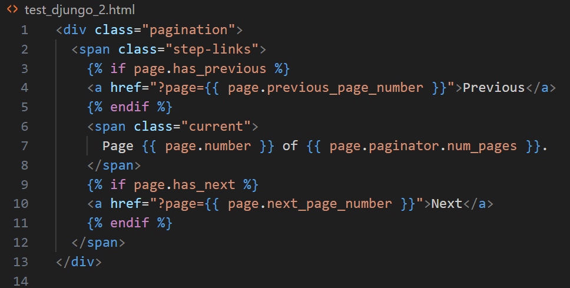

# Introduction

This project provides syntax highlighting for strings containing JSON, XML, or Selenium selectors in Python using VS Code extensions. The highlighting is based on the content of the string and uses regular expressions to determine the format of the content. For example, the following regular expression is used for Selenium selectors:

```regex
"begin": "((?<=By\\.CSS_SELECTOR,\\s*)(')|(')(?=(div|a)(\\.|\\[|#)))\\s*"
```

However, using regular expressions has its limitations. For instance, in TextMate markup, it is not possible to check whether a variable is used in a specific context, which is achievable in more powerful tools like PyCharm.

## Improvements with Language Server

A more accurate and refined solution can be implemented using a Language Server. A Language Server allows for context-aware analysis of variable and function usage, which is not possible with TextMate markup. This enables functionality similar to that of PyCharm.

## Grammar Files

To implement the highlighting, an injection grammar file, such as `python-json.json`, needs to be added. Additionally, a `python-json-pattern.json` file is required to manage the enabling and disabling of specific highlighting by editing the grammar file. Settings can be improved by examining how they are implemented in other extensions, such as lit extensions for JavaScript and TypeScript (hugo-vrijswijk.vscode-lit-xml, runem.lit-plugin).

## Declaring the Grammar

To activate the highlighting, the grammar must be declared in the `package.json` file. Additionally, the Django syntax highlighting is supported using a grammar file from the (batisteo.vscode-django) extension. To do this, you need to select the language Django HTML



## Conclusion

This project provides a powerful tool for syntax highlighting in Python, based on the content of strings and their usage context. Using a Language Server for more precise context handling will enable a high level of functionality and ease of use.
